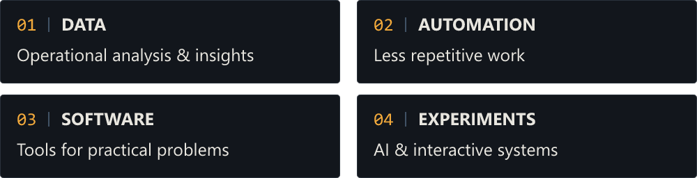

<picture>
  <source media="(max-width: 600px)" srcset="assets/hero/github-profile-banner-mobile.png">
  
</picture>

### // HELLO

Hi, I'm Luciano. I work with data analysis, process automation and software, building tools that make operational work simpler.

Outside professional work, I explore AI, personal computing and interactive systems through personal software projects.

### // WHAT I BUILD

<picture>
  <source media="(max-width: 1000px)" srcset="assets/modules/what-i-build-mobile.png">
  
</picture>

### // TOOLBOX

<strong>DATA &amp; AUTOMATION</strong> 
Excel · Power Query · SQL 
Google Apps Script · VBA · Python

<strong>SOFTWARE &amp; AI</strong> 
TypeScript · JavaScript · React 
Git · AI Tooling · Godot

### // SELECTED WORK

<strong>DATA / AUTOMATION</strong> 
My professional practice: operational data analysis, reporting and data transformation; spreadsheet and workflow automation; internal productivity tools.

Professional work stays private. [PUBLIC LABS → PLANNED](docs/DATA_AUTOMATION_PORTFOLIO_PLAN.md), using synthetic data.

**SOFTWARE / AI / EXPERIMENTS** — [Current personal projects ↓](#-currently-building).

### // CURRENTLY BUILDING

 <strong>Guia IA</strong> — A practical AI guide in Portuguese. 
<code>PRIVATE / IN DEVELOPMENT</code>

 <strong>Two Paws</strong> — A cat-driven exploration game. 
<code>PRIVATE / PRE-PRODUCTION</code>

### // NOW

- Working with data and automation.
- Deepening software engineering and AI practice.
- Preparing experiments for public, documented work.

---

Luciano Barbosa · Brazil · **// 616**
