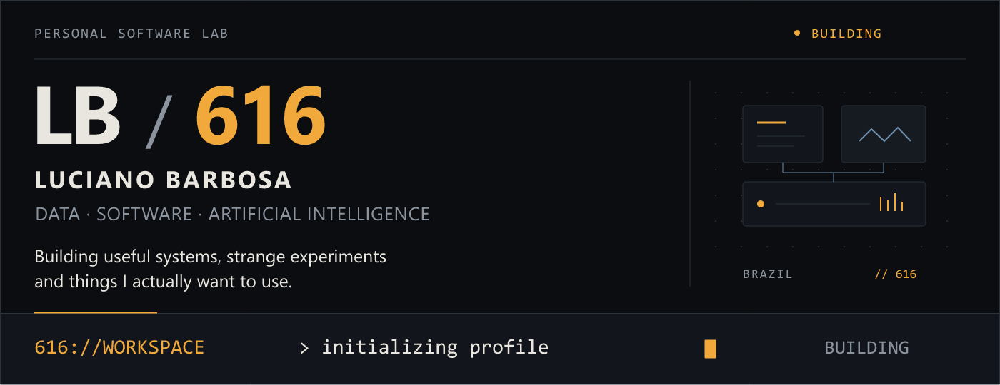
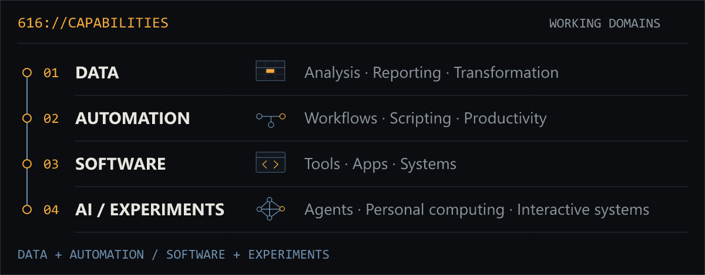
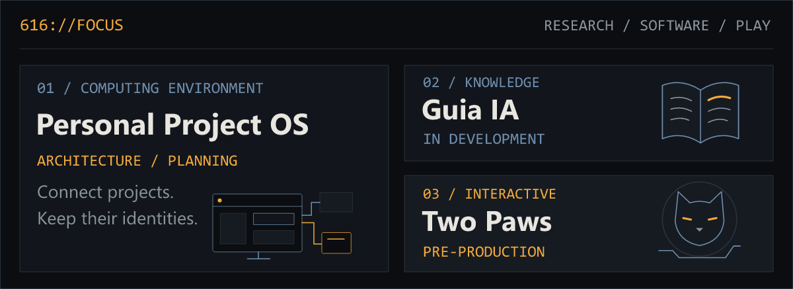
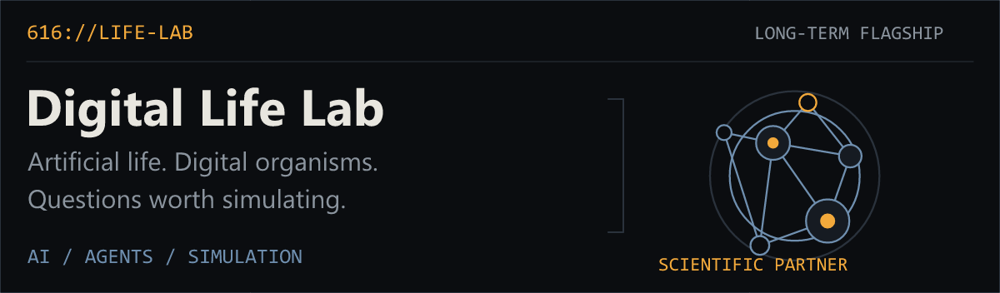
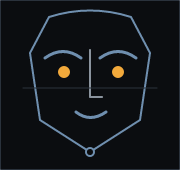
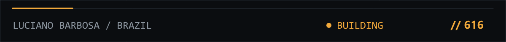

<a href="#-system-profile">
<picture>
  <source media="(prefers-reduced-motion: reduce) and (max-width: 600px)" srcset="assets/workstation/boot-static-mobile.png">
  <source media="(prefers-reduced-motion: reduce)" srcset="assets/workstation/boot-static.png">
  <source media="(max-width: 600px)" srcset="assets/workstation/boot-mobile.png">
  
</picture>
</a>

<a href="#-system-profile">PROFILE</a> ·
<a href="#-capability-console">CAPABILITIES</a> ·
<a href="#-project-registry">PROJECTS</a> ·
<a href="#-professional-practice">DATA</a> ·
<a href="#-now">NOW</a>

### // SYSTEM PROFILE

<table>
<tr><td><code>NAME</code></td><td>Luciano Barbosa</td></tr>
<tr><td><code>BASE</code></td><td>Brazil</td></tr>
<tr><td><code>WORK</code></td><td><strong>Data / Automation</strong></td></tr>
<tr><td><code>BUILD</code></td><td>Software / AI</td></tr>
<tr><td><code>MODE</code></td><td>Building &amp; experimenting</td></tr>
</table>

I work with data analysis, process automation and software, making operational work simpler. My personal lab explores AI, computing and interactive systems.

### // CAPABILITY CONSOLE

<picture>
  <source media="(max-width: 1000px)" srcset="assets/workstation/capability-console-mobile.png">
  
</picture>

Understand the data → simplify the workflow → build the tool → test it in context.

### // PROFESSIONAL TOOLCHAIN

**01 / DATA & AUTOMATION**

Excel · Power Query · SQL Google Apps Script · VBA · Python

**02 / SOFTWARE & AI**

TypeScript · JavaScript · React Git · AI Tooling · Godot

### // CURRENT FOCUS

<a href="#-project-registry">
<picture>
  <source media="(max-width: 1000px)" srcset="assets/workstation/current-focus-mobile.png">
  
</picture>
</a>

<a href="#personal-project-os">Personal Project OS</a> · architecture / planning <a href="#guia-ia">Guia IA</a> · in development <a href="#two-paws">Two Paws</a> · pre-production

### // PROJECT REGISTRY

Explore the records.

**CORE / FLAGSHIP**

<strong>01 / DIGITAL LIFE LAB</strong> FLAGSHIP · LONG-TERM PROJECT

<picture>
  <source media="(max-width: 1000px)" srcset="assets/workstation/digital-life-lab-mobile.png">
  
</picture>

Long-term research into artificial life, AI agents, simulation and research tools.

**└ Scientific Partner** · RESEARCH SUBSYSTEM 
A research companion within Digital Life Lab.

<strong>02 / PERSONAL PROJECT OS</strong> CORE · ARCHITECTURE / PLANNING

A personal computing environment designed to connect projects, tools and AI workflows without absorbing them.

**Tracks:** Project Registry · Developer Tools · AI · Local-first systems.

**SOFTWARE / INTERACTIVE**

<strong>03 / GUIA IA</strong> PRIVATE · IN DEVELOPMENT

A practical Brazilian guide to working with modern AI. **Tracks:** education · React · TypeScript.

<strong>04 / TWO PAWS</strong> PRIVATE · PRE-PRODUCTION

A cat-driven exploration game. **Tracks:** Godot · exploration · game design · interactive systems.

**LAB / EXPLORATION**

<strong>05 / PRESENÇA IA</strong> EXPERIMENT · TECHNOLOGY EXPLORATION

Exploring visual identity for AI through face, gaze, expression and embodied interfaces.

**Tracks:** Animation · AI Interface · Digital Presence.

### // PROFESSIONAL PRACTICE

**Data & automation for everyday operations.**

<strong>DATA / operational analysis &amp; reporting</strong>

Operational analysis, reporting and transformation. Turn everyday records into clear, useful information.

<strong>AUTOMATION / spreadsheets &amp; workflows</strong>

Spreadsheet automation, scripts and repeatable workflows that simplify routine work.

<strong>TOOLS / productivity &amp; process</strong>

Internal productivity tools built around practical work, with simpler processes and easier access to information.

PUBLIC CASES / <a href="docs/DATA_AUTOMATION_PORTFOLIO_PLAN.md">Synthetic-data labs in preparation →</a>

### // NOW

Data & automation. Software & AI. Experiments becoming documented work.

<a href="#-system-profile">↑ BACK TO PROFILE</a>

<picture>
  <source media="(max-width: 1000px)" srcset="assets/workstation/footer-mobile.png">
  
</picture>
