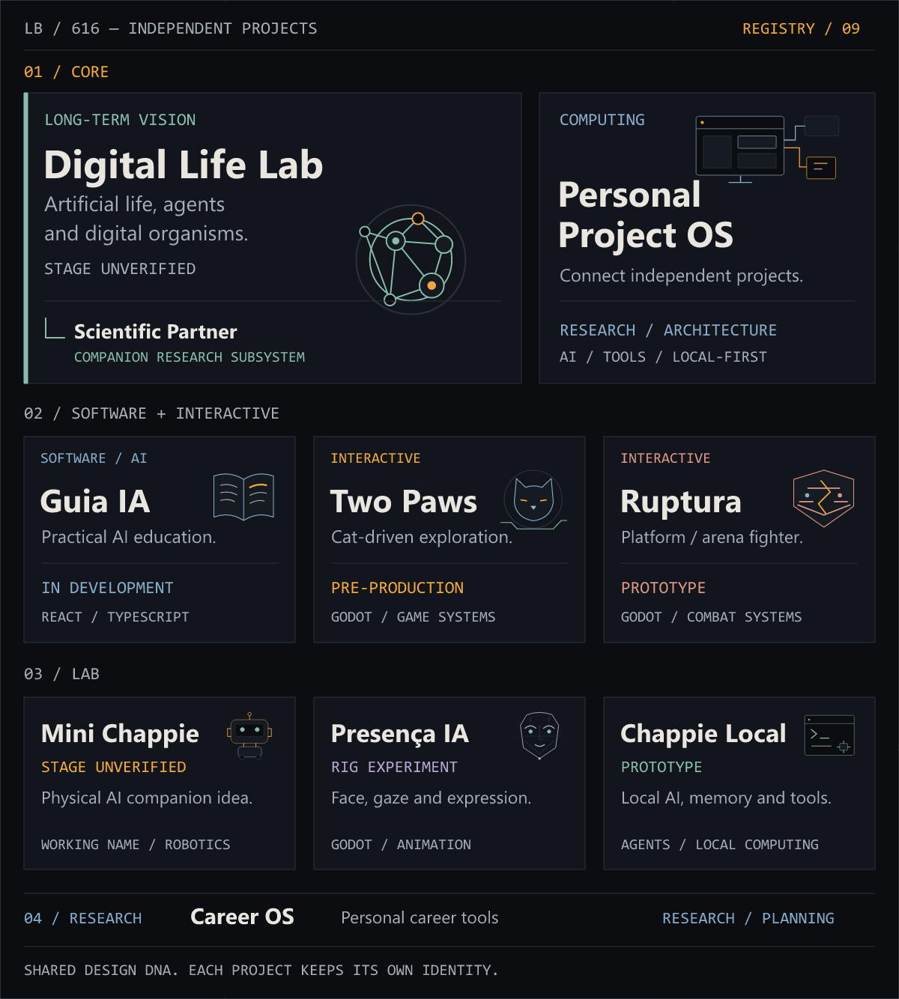
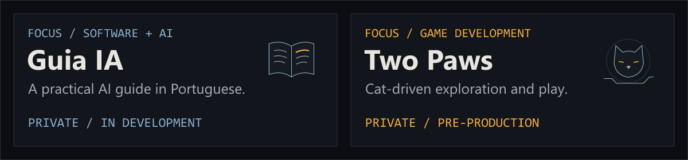

<picture>
  <source media="(max-width: 600px)" srcset="assets/hero/github-profile-banner-mobile.png">
  
</picture>

### // HELLO

Hi, I'm Luciano. I work with data analysis, process automation and software, building tools that make operational work simpler.

Outside professional work, I connect a personal ecosystem of research, software, games and experiments. Each project keeps its own purpose and identity, with a shared way of building: **LB / 616**.

### // WHAT I BUILD

<picture>
  <source media="(max-width: 1000px)" srcset="assets/modules/what-i-build-mobile.png">
  
</picture>

### // TOOLBOX

<strong>DATA &amp; AUTOMATION</strong> 
Excel · Power Query · SQL 
Google Apps Script · VBA · Python

<strong>SOFTWARE &amp; AI</strong> 
TypeScript · JavaScript · React 
Git · AI Tooling · Godot

### // SELECTED WORK

<strong>DATA / AUTOMATION</strong> 
My professional practice: operational data analysis, reporting and data transformation; spreadsheet and workflow automation; internal productivity tools.

Professional work stays private. [PUBLIC LABS → PLANNED](docs/DATA_AUTOMATION_PORTFOLIO_PLAN.md), using synthetic data.

**SOFTWARE / AI / EXPERIMENTS** — [Explore the project ecosystem ↓](#-616-project-registry).

### // 616 PROJECT REGISTRY

Independent projects, connected by curiosity, tools and a shared design DNA. This is the ecosystem map; current focus comes next.

<picture>
  <source media="(max-width: 1000px)" srcset="assets/projects/project-registry-mobile.png">
  
</picture>

Ideas and development stages, reviewed September 2026. Digital Life Lab and Mini Chappie describe intended directions; their current files and implementation still need verification. Mini Chappie is a working name. Project source remains private.

Project ideas &amp; stage notes — text version

**CORE**

- **Digital Life Lab** — A long-term artificial-life laboratory for digital organisms, AI, agents, simulation and research tools. **Stage unverified.** Scientific Partner belongs within this vision as a companion research subsystem; its implementation is also unverified.
- **Personal Project OS** — A personal computing environment designed to connect independent projects while preserving their identities. **Research / architecture**; implementation has not started.

**SOFTWARE / INTERACTIVE**

- **Guia IA** — A practical Brazilian guide to working with modern AI, using React and TypeScript. **In development.**
- **Two Paws** — A cat-driven exploration game built around interactive systems in Godot. **Pre-production**, with local gameplay prototypes.
- **Ruptura** — An original platform / arena fighter exploring combat systems and worldbuilding in Godot. **Local prototype**; no public release verified.

**LAB**

- **Mini Chappie** — The idea of a compact physical robot companion with local AI and personality. **Stage and official name unverified.** No hardware implementation is claimed.
- **Presença IA** — An animated visual presence for AI, exploring face, gaze and expression in Godot. **Rig experiment.** The inspected files use the provisional name *Local AI Presence* and a 2D rig; 3D and live AI integration are not verified.
- **Chappie Local** — A personal local AI assistant with conversation, memory and controlled tools. **Prototype**, with a later rebuild plan; full desktop validation remains pending.

**RESEARCH**

- **Career OS** — A personal career system organized around evidence and learning. **Research / planning**; implementation has not started.

### // CURRENTLY BUILDING

<picture>
  <source media="(max-width: 1000px)" srcset="assets/projects/currently-building-mobile.png">
  
</picture>

**Guia IA** — practical AI education · **Two Paws** — gameplay prototyping.

### // NOW

- Working with data and automation.
- Deepening software engineering and AI practice.
- Preparing experiments for public, documented work.

---

Luciano Barbosa · Brazil · **// 616**
