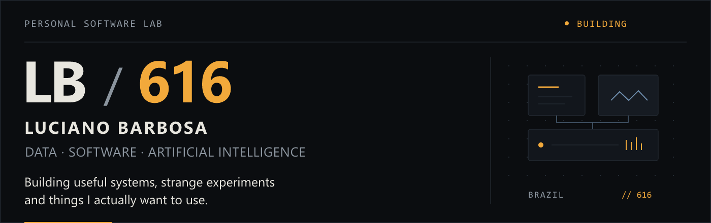
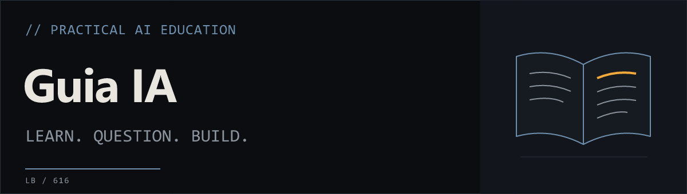
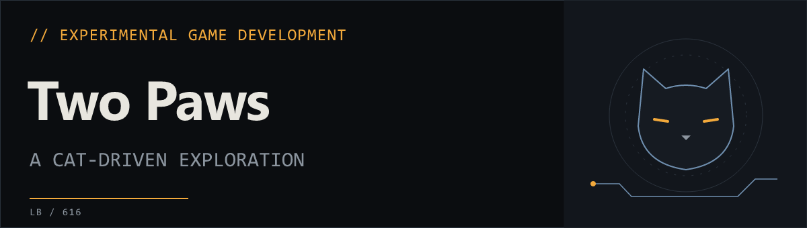

<picture>
  <source media="(max-width: 600px)" srcset="assets/hero/github-profile-banner-mobile.png">
  
</picture>

### // HELLO

Hi, I'm Luciano, based in Brazil. I work with data analysis, process automation and software, building tools that reduce repetitive work and make operational data useful.

Alongside my professional work, I build personal tools and explore artificial intelligence, personal computing and interactive systems.

### // WHAT I BUILD

**DATA** — Analysis, reporting and operational insights.

**AUTOMATION** — Workflows and tools that remove repetitive work.

**SOFTWARE** — Applications and utilities built around practical problems.

**EXPERIMENTS** — AI, personal computing, simulations and interactive systems.

### // TOOLBOX

**// DATA & AUTOMATION**

Excel · Power Query · SQL · Google Apps Script · VBA · Python

**// SOFTWARE & AI**

TypeScript · JavaScript · React · Git · AI Tooling · Godot

### // CURRENTLY BUILDING

- **Guia IA** — a practical Brazilian guide to working with modern AI. `PRIVATE · IN DEVELOPMENT`
- **Two Paws** — an experimental cat-driven exploration game. `PRIVATE · PRE-PRODUCTION`

### // SELECTED WORK

**DATA / AUTOMATION · Professional practice**

My professional work includes operational data analysis, reporting, data transformation, spreadsheet automation and internal productivity tools. This work stays private; public examples using synthetic data are [planned](docs/DATA_AUTOMATION_PORTFOLIO_PLAN.md).

The personal projects below currently represent software, AI and interactive experiments.

**SOFTWARE / AI**

**Guia IA** · `PRIVATE / IN DEVELOPMENT`

A guide in Brazilian Portuguese for learning to work with modern AI. Built with React and TypeScript, with an emphasis on clear explanations and practical use.

**EXPERIMENTS / INTERACTIVE SYSTEMS**

**Two Paws** · `PRIVATE / PRE-PRODUCTION`

An exploration game built around cats, using Godot. A place to experiment with movement and interactive systems.

These personal projects are in development, with private source repositories. The covers are identity artwork, not application screenshots.

### // NOW

- Working with data, automation and software.
- Building personal tools and AI experiments.
- Deepening my software engineering and AI practice through personal computing and interactive systems.

### // CONNECT

[Find me on GitHub](https://github.com/616byron)

---

Luciano Barbosa · Brazil · // 616
